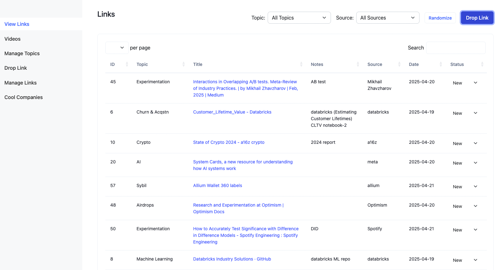
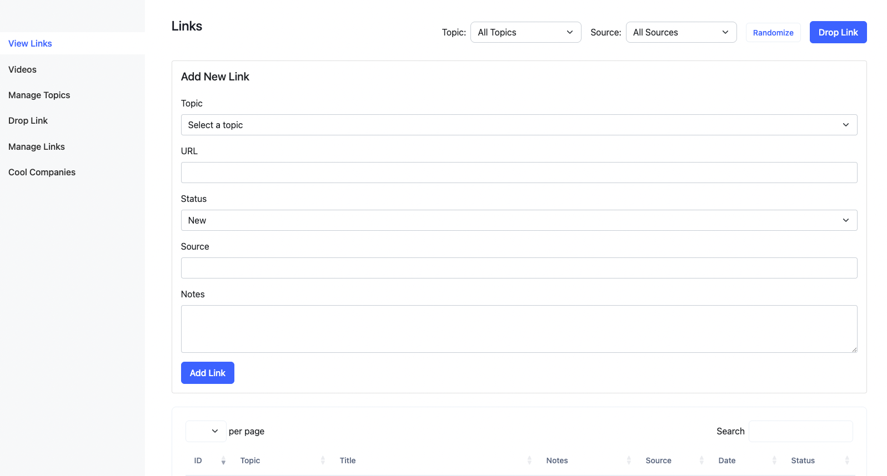

# Droplink

A comprehensive link management system built with FastAPI and Supabase, designed to organize and manage links, topics, companies, and videos.

## Features

- **Link Management**
  - Add links with topics, sources, and notes
  - Automatic title fetching from URLs
  - Track link status (new, read, read-again)
  - Filter links by topics and sources
  
- **Topic Management**
  - Create and organize topics
  - Delete topics
  
- **Additional Features**
  - Company tracking with notes
  - Video library with topic organization
  - Clean and responsive interface
  - Automatic date tracking


## Preview
*View Links <br>
 <br>
*Drop Link<br>



## Setup

1. Create a virtual environment:
```bash
python -m venv venv
source venv/bin/activate  # On Windows: venv\Scripts\activate
```

2. Install dependencies:
```bash
pip install -r requirements.txt
```

3. Create a `.env` file in the root directory with your Supabase credentials:
```
SUPABASE_URL=your_supabase_url
SUPABASE_KEY=your_supabase_key
```

4. Create the required tables in your Supabase database:

```sql
-- Links table
create table links (
    id bigint primary key generated by default as identity,
    topic text not null,
    url text not null,
    title text not null,
    source text,
    notes text,
    status text default 'new',
    date date not null
);

-- Topics table
create table topics (
    name text primary key
);

-- Companies table
create table companies (
    id bigint primary key generated by default as identity,
    name text not null,
    url text not null,
    notes text,
    date date not null
);

-- Videos table
create table videos (
    id bigint primary key generated by default as identity,
    topic text not null,
    link text not null,
    title text not null,
    notes text,
    date date not null
);
```

5. Run the application:
```bash
uvicorn main:app --reload
```

## Usage

### Main Pages

- `/` - Drop page for quick link submission
- `/view` - View and filter all saved links
- `/manage/links` - Manage and edit existing links
- `/manage/topics` - Manage topics
- `/companies` - Track and manage company information
- `/videos` - Organize and manage video links

### Link Management

- Add links with topics, sources, and optional notes
- Links automatically fetch titles from URLs
- Track link status (new, read, read-again)
- Filter links by topics and sources
- Edit or delete links as needed

### Topic Management

- Create new topics for organization
- Delete topics (only if not in use)
- Use topics to categorize both links and videos

### Company Tracking

- Store company information with URLs and notes
- Track when companies were added
- Edit or remove company entries

### Video Library

- Organize videos by topics
- Store video links with titles and notes
- Edit or remove video entries

## Development

The application is built with:
- FastAPI for the backend
- Supabase for database management
- Jinja2 for templating
- Bootstrap for styling 